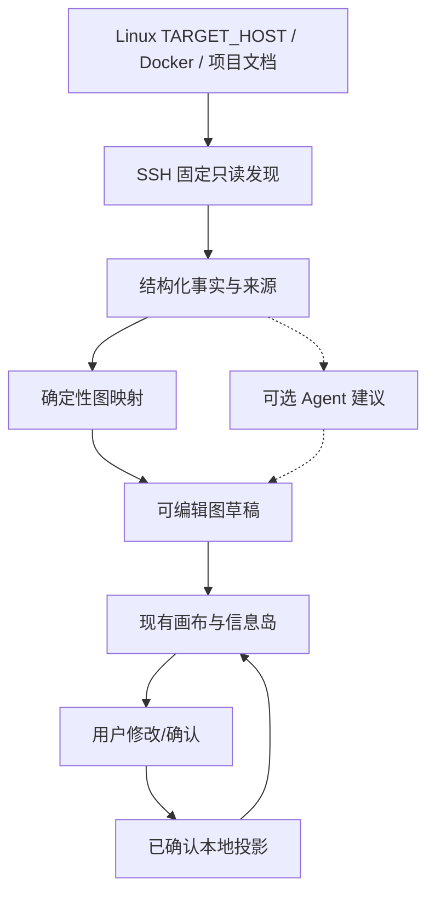

# 画布编辑与系统设计文档

- **文档状态**：现有画布基线 + 可视化优先的 MVP-1 系统边界
- **版本**：0.5
- **日期**：2026-08-10

## 1. 设计判断

本系统首先是覆盖在既有数字系统之上的可视化投影与管理层。Business 是用户定义的业务语义层，TechnicalProject 是运维项目边界，Deployment 和 HOST 是外部可观察对象；本系统只登记、发现和投影它们，不承担基础设施采购或创建。外部干预是 Post-MVP。

画布是主要编辑和观察界面，但不是唯一事实载体；底层事实、草稿和已确认投影由 API/数据库保存。MVP-1 的辅助 Agent 只能提出带证据的建议，用户可以完全手动管理。

核心原则：

> 先如实映射已有世界，再允许用户管理本地投影；辅助 Agent 和外部干预均不能成为上图前提。

## 2. 分层架构



长期的共享策略、流程运行、能力网关和外部控制可在 MVP-1 通过后增量加入，不在当前架构主链上预建。

### 2.1 原系统层

原系统继续拥有实际资源和执行逻辑。可以是任意 Agent 框架、工作流引擎、脚本、服务 API 或人工操作。用户必须先拥有或能够访问这些对象；本系统不把登记动作解释成创建动作。

### 2.2 MVP-1 辅助 Agent

现有业务统筹 Agent 入口和视觉元素继续保留，但 MVP-1 后端只实现一个轻量初始化辅助会话，职责限定为：

- 读取扫描器已经生成的结构化事实和脱敏文档摘要；
- 对确定性图草稿提出归类、关系解释、必要问题和可编辑补丁；
- 为建议附带证据引用、理由与置信度；
- 接受用户回答，但不直接发布投影。

模型未配置或调用失败时，确定性图草稿、人工编辑和确认仍可工作。两层 Agent 责任网络、外部 Agent 调用与跨项目协调见 `docs/11`，均为 Post-MVP。

### 2.3 适配层

MVP-1 只有同进程 Rust SSH 发现模块，提供：

- `discover`：发现实体和基础属性；
- `observe`：读取 Docker/Compose 当前状态和受限文档元数据。

`query / control / execute`、外部插件协议和第二种适配器在出现真实需求后重新设计。

### 2.4 事实与事件层

概念上保留四种原语：

1. **Entity**：外部实体的统一引用；
2. **Fact/Event**：关系声明、状态和运行事件；
3. **ProjectionDraft**：确定性映射、Agent 建议和人工编辑形成的待确认图；
4. **ProjectionVersion**：用户确认后的不可变本地投影版本。

关系图是事实和投影版本的读模型。每项信息至少带：来源、外部 ID、观察时间、版本和新鲜度；Agent 建议另带置信度，不把置信度字段冒充事实。

### 2.5 当前项目层级与后续共享资源

```text
个人业务网（Workspace）
├── Business
│   └── TechnicalProject
│       └── ProjectTarget
│           ├── Deployment
│           └── Linux HOST
├── 未归类 DeploymentCandidate
└── 共享资源、流程、Agent 与知识库引用
```

- Business 是业务语义边界，TechnicalProject 是 Project Agent 的运维责任边界；二者都不等同于 HOST 或单个 Compose 项目。
- ProjectTarget 是本地关联记录，把 TechnicalProject 指向具体 Deployment 和 HOST；它不改变外部部署身份。
- MVP-1 只实现项目归类、资源关系、布局、归档和忽略；同一外部对象保留稳定身份，不因用户分组复制事实。
- CodeWorkspace 不属于运维核心模型；代码仓库和开发动作由专用开发 Agent 管理。
- 命名共享组、项目级访问规则和动作权限保留现有视觉设计，但其真实治理属于 Post-MVP。

未来访问判定的基本顺序为：

```text
项目禁用？       → 是：拒绝
资源为项目私有？ → 非所属项目：拒绝
资源在共享组？   → 默认允许观察/查询
动作需要写入/控制？→ 再检查能力、令牌引用和审批
```

## 3. 画布模型

### 3.1 两层作用域与四个问题

界面先确定作用域，再选择该作用域中的问题。全局层和项目层共享同一实体目录，但项目流程不能脱离项目上下文成为全局入口。图是主界面，文字详情按需浮出。

MVP-1 首批接入真实数据的视图只有“总览/全局业务网”和“项目资源”；全局资源、项目运行与流程继续保留现有视觉，但在接入真实来源前标记为 Fixture 或不可用。

#### 总览（Overview）

用于查看个人业务网的全局结构。保留现有业务统筹 Agent 节点和布局，但当前真实数据层优先显示 HOST、项目、未归类候选、来源和待确认状态；不要求实现业务统筹 Agent 责任网络。位置表达归属，节点大小表达组织层级。

#### 全局资源（Global Resource）

用于盘点全局共享资源，并从单一共享实体反查全部使用项目与工作负载。它不混入项目私有资源，也不在此处编辑项目流程。

#### 服务器资产（Global Hosts）

用于集中查看 HOST 的连接状态、发现状态、Provider 覆盖、最近观测和 Deployment 列表。页面入口为 global/hosts；它与共享资源反查分开，服务器操作仍然限定为登记、重连和固定只读发现。

#### 项目运行与流程（Project Run & Flow）

用于表达一个已选项目“这一次实际上怎样运行”以及“系统应该怎样工作”。进入项目默认显示运行模式。流程框架和运行实例不再分成两张图：它们共享节点、连线、布局和版本骨架，只切换交互权限与事实覆盖层。

- **编辑模式**：允许添加、移动、连接和配置步骤、分支、闸门及恢复路径；修改进入草稿。
- **运行模式**：画布只读；选择实时或历史实例后，叠加实际路径、当前步骤、跳过分支、耗时、结果和回执。

#### 项目资源（Project Resource）

用于回答当前 TechnicalProject 绑定了哪些 Deployment、HOST 和资源。项目边界内显示私有资源，边界外显示共享引用；点击共享引用跳到全局资源反查。同一个 HOST 或共享资源始终只有一个实体，多项目使用由 ProjectTarget/关系表达。

最终层级为：`个人业务网 →（全局业务网 / 全局资源 / 项目 → 运行与流程 / 项目资源）`。统一的图形编码与验收条件见 `docs/06-可视化第一性原理与界面规则.md`，整合细节见 `docs/07-流程中心与资源视图整合方案.md`。

### 3.2 流程定义与运行实例

最小关系为：

```text
FlowDefinition
└── FlowVersion（不可变的已发布骨架）
    └── FlowRun（一次运行事实）
        └── NodeRun（节点级状态、时间与回执）
```

`FlowRun.definition_version_id` 必须固定。用户从 `v3` 开始编辑时产生 `v4-draft`；`RUN-028` 若由 `v3` 启动，就永远在 `v3` 上解释和回放。发布 `v4` 只影响其后的新实例。

### 3.3 节点类型

视觉语言保留五个节点族：

- **组织节点**：个人业务网、Business、TechnicalProject、共享组；
- **部署节点**：Deployment、Compose service、systemd unit、PM2 app 等运行单元；
- **资源节点**：HOST、服务、知识库、域名、网络、卷和文档等已有对象；代码仓库只作为外部版本或文档引用；
- **Agent 节点**：内置业务统筹 Agent、已有 Agent 或可调用的决策能力；
- **工作节点**：工具、固定工作流、弹性工作流、监控和验证；
- **控制节点**：触发、条件、策略、目标状态、批准和恢复。

具体类型由适配器扩展，不修改核心画布。

MVP-1 的真实节点子集只包括 `workspace / host / project / compose_project / service / container / network / volume / port / document`。下一阶段增加 business、technical_project、deployment_candidate、deployment、project_target 和 provider_capability。Agent、工作流与控制节点在有真实来源前只能是明确标记的 Fixture。

### 3.4 关系类型

优先使用少量通用关系：

- 负责；
- 运行于；
- 依赖；
- 触发；
- 调用；
- 读取；
- 写入；
- 委托；
- 验证。

关系应区分：

- 用户配置关系；
- 外部系统声明关系；
- 系统探测关系；
- 运行时观察关系。

## 4. 编辑语义

### 4.1 画布不是唯一事实源

画布保存的是声明式投影配置（布局、分组、别名、引用、共享关系和监控规则）。外部资源的真实存在、运行状态和能力仍从原系统读取。登记一个项目只产生本地投影，不代表外部项目已经创建；任何外部写入都必须经过适配器并重新验证。

### 4.2 草稿、发布与回滚

本地投影修改流程：

1. 用户或 Agent 产生草稿；
2. 系统展示差异、影响范围和项目/共享组权限；
3. 用户发布或撤销；
4. 系统保存版本并更新投影；
5. 失败时保留草稿和可执行的逆向动作。

Post-MVP 外部配置修改流程：

1. 用户或 Agent 产生结构化外部变更草稿；
2. 系统检查适配器能力、凭据引用、项目访问规则、影响范围和审批要求；
3. 经过授权后由能力网关调用原系统；
4. 重新读取原系统并记录回执；
5. 失败时保留草稿，不把请求状态写成外部成功状态。

业务统筹 Agent 和其他 Agent 只能提交结构化差异，不直接静默改写已发布投影或外部系统。

### 4.3 子图与组件

项目、工作流或资源组合都可以折叠为子图。组件对外暴露：

- 输入；
- 输出；
- 所需能力；
- 事件；
- 权限；
- 版本。

内部结构可替换，外部契约保持稳定。

## 5. 交互与 Post-MVP 干预

用户可以从节点、关系或运行步骤发起：

- 解释：为什么发生；
- 追踪：影响了什么；
- 询问：当前状态和下一步；
- 控制：暂停、取消、改向或批准；
- 回放：重新查看一项历史任务。

所有动作显示“请求中、已接收、执行中、成功、失败或能力不可用”，不把请求发送成功误认为原系统执行成功。

MVP-1 只实现解释、来源查看、草稿编辑、确认、归档、忽略和重新扫描。暂停、取消、改向、批准及其他外部控制保持禁用或后续能力状态。

## 6. Post-MVP 自主运行边界

本系统优先观察并调用原有运行时。内置业务统筹 Agent 可以跨项目协调信息和请求，但不直接拥有所有外部资源的执行权，也不替代项目内既有 Agent。真正的控制循环仍由原系统或明确绑定的控制器负责；每个控制器拥有明确资源、目标状态、权限和停止条件，避免多个执行者争抢同一资源。

自治闭环：

> 观察当前状态 → 对比目标状态 → 调用既有能力 → 验证结果 → 更新投影

业务统筹 Agent 在该闭环中主要负责“整理、解释、提出请求和汇总”，确定性的采集、去重、健康检查、状态迁移和回执核对由适配器与网关完成。

## 7. 可观测性与数据治理

- 优先采用开放追踪语义，兼容 OpenTelemetry；
- 事件中保存输入输出摘要和引用，默认脱敏；
- 凭据只保存为安全存储引用；
- 支持事件采样、分级保留和按项目隔离；
- 显示数据新鲜度，过期数据不得伪装成实时状态；
- 记录配置版本、发布者、外部回执和干预链路。
- 记录项目/共享组访问判定、禁用原因和恢复时间；令牌只显示引用、有效性摘要和最后核验时间。

### 7.1 Post-MVP 持续监控与健康状态

监控只对已经登记且具备观察能力的外部对象生效。服务器页面和项目资源页必须把以下信号分开：

- HOST connection state；
- Provider discovery state；
- Deployment observation freshness；
- Project Agent cycle state；
- Business/TechnicalProject health。

Docker 或单个服务健康检查不能直接推出业务健康。最小状态字段为：

```text
resource_id / deployment_id / project_id
check_type
checked_at
status: healthy | degraded | unreachable | credential_expired | stale
source
summary
next_check_at
```

“检查请求已发出”与“资源检查成功”是两条不同事件。适配器未返回结果、令牌引用失效或超过新鲜度窗口时，界面显示对应状态，不推断资源正常。

## 8. 行业模式复用

- 借鉴 n8n 的节点连接和画布交互；
- 借鉴 LangGraph 的混合图执行和人工中断；
- 借鉴 Temporal 的持久任务与故障恢复；
- 借鉴 OpenTelemetry 的跨运行时追踪语义；
- 借鉴 Backstage 的实体目录、所有权和插件模型；
- 借鉴 Kubernetes 的期望状态与多控制器模式。

第一版不实现上述系统的全部能力，而是把它们作为外部运行时或适配器接入。

## 9. 主要设计风险

- 全局画布规模过大导致认知负担；
- 把本地项目投影误认为外部项目已创建，造成责任和状态错位；
- 多个控制器同时修改同一资源；
- 关系来源不明导致错误拓扑；
- 共享组默认开放过宽或项目级禁用规则未生效；
- 外部系统不支持暂停或回滚；
- Agent 生成的配置与原系统配置漂移；
- 事件含有敏感提示、输出或凭据；
- 适配器插件带来过大的执行权限；
- 长任务依赖单次对话状态而中断后丢失。

## 10. MVP-1 技术取舍

- 先固定现有画布的数据契约与 DataSource，不重写视觉；
- 先接一个 Linux HOST 的 SSH/Docker/文档事实，再做确定性图草稿；
- 先完成全局业务网和项目资源图的人工管理，不等待 Agent；
- Agent 只在核心图通过后增加建议、解释和问题；
- 项目流程/运行、共享治理、时间线真实接入和外部干预均为 Post-MVP；
- 画布图不自动推导出数据库选型，先选择最简单可验证的存储和投影方案；
- MVP-1 的写入只修改本地草稿/投影；不写 TARGET_HOST。
