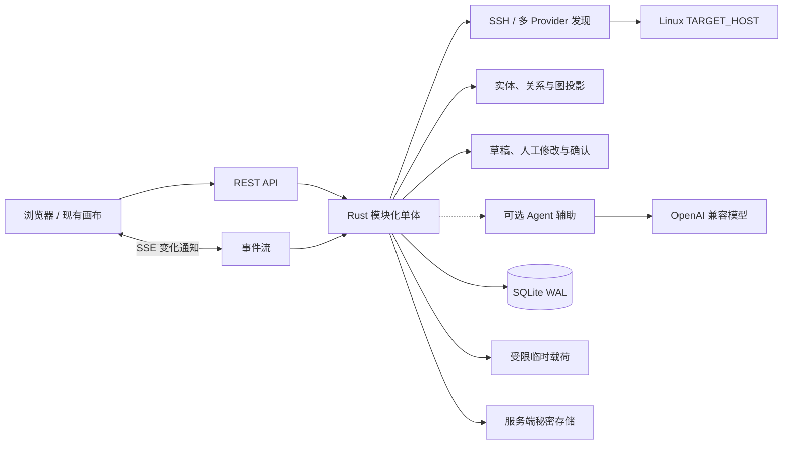

# 前后端 API 与数据架构草案

- **状态**：可视化优先的 MVP-1 契约收敛稿
- **版本**：0.6
- **日期**：2026-08-12
- **适用范围**：Linux 服务器远程部署、单一所有者、SSH 只读发现、真实图草稿、人工投影管理、轻量 Agent 辅助

> 这份文档先解决“前端究竟需要什么数据和命令”，再决定后端模块与存储。它不把登记投影解释成创建外部项目，也不要求首版同时部署多种数据库。

> 后端语言、运行时和契约生成链路已经在 [Rust 后端架构与前后端契约决策](./09-Rust后端架构与前后端契约决策.md) 中确认；本文与其冲突的早期运行时假设以该决策文档为准。

> 顺序约束：API 必须先支持“事实 → 图草稿 → 人工修改/确认”，再支持 Agent 建议。模型未配置或不可用时，前端仍能完成核心可视化管理。

## 1. 先校正两个前提

### 1.1 前端每个交互都不需要 API

前端状态先分成三类：

| 状态类别 | 例子 | 持久化位置 | 是否需要后端 API |
| --- | --- | --- | --- |
| 纯界面状态 | 当前选中节点、Hash、画布缩放/平移、面板焦点、Toast | 浏览器内存 / URL Hash | 否 |
| 本地投影配置 | 项目登记、资源引用、共享组、访问开关、节点布局、流程草稿 | 后端主库 | 是 |
| 外部事实与投影状态 | Docker/Compose 事实、来源、新鲜度、扫描差异、草稿与确认版本 | 事实表 + 当前投影 | 是，且带来源与时间 |

如果把第一类状态也设计成 API，会增加延迟、并发和恢复成本，却没有增加事实价值。

### 1.2 “需要哪些数据库”不等于“先上很多数据库”

MVP-1 的事实边界只有一个：

```text
SQLite 主库（配置、关系、脱敏证据、运行轨迹、审计）
    + 任务临时目录（原始输出完成结构化与脱敏后清理）
    + Linux 受限权限凭据文件（秘密本体）
    + SSH HOST/Docker 发现适配器（首个事实来源）
+ 外部知识库/运行时适配器（后续事实来源）
```

图数据库、Redis、专用向量数据库、独立消息队列都暂不作为前置依赖。关系图由实体表和关系表投影，事件量达到明确阈值后再拆分。

## 2. 当前前端需要的后端事实

当前原型中的 `projects`、`resources`、`projectResources`、`worldNodes`、`worldEdges`、`agentOperations`、`projectRunTimelines`、`workflowBase` 和 `runStates` 都是后端需要逐步替换的样本数据。

| 前端区域 | 首屏需要的读模型 | 用户命令 | 后端结果 |
| --- | --- | --- | --- |
| 全局业务网 | 业务、已确认项目、未归类业务关系、来源和待确认计数；不以 HOST 作为业务首屏 | 刷新、选择项目、拖动并保存布局 | 真实图快照、布局修订 |
| 项目资源 | Compose 服务/容器、网络、卷、端口、文档及关系 | 更名、移动、合并、拆分、修改关系、忽略、确认 | 可编辑图草稿、投影版本、差异 |
| 初始化/发现 | HOST、指纹、连接状态、扫描进度、证据摘要和错误 | 登记、确认指纹、连接检查、启动扫描 | 发现任务、版本化事实包 |
| Agent 辅助 | 当前草稿、证据引用、建议、问题和不可用状态 | 配置模型、采用/拒绝建议、回答问题 | 可选建议层和补丁，不直接发布 |
| 项目运行与流程 | 当前原型 Fixture 或禁用状态 | 保留现有交互演示 | Post-MVP 真实运行契约 |
| 全局资源/共享治理 | 当前原型 Fixture 或局部只读投影 | 保留现有视图 | Post-MVP 完整共享与权限契约 |

### 2.1 前端与 API 的最小边界

首版 API 的结果分成四类；前三类构成核心路径，第四类是 Agent 增强：

1. **快照**：页面打开时取得完整图、任务或草稿读模型；
2. **命令与版本**：发现、人工编辑和确认返回稳定 ID、修订号与状态；
3. **增量事件**：扫描和投影变化通过 SSE 通知，最终状态仍由快照恢复；
4. **Agent 建议**：基于证据生成可选建议、问题和补丁；缺失时不影响前三类。

## 3. 推荐的后端形态



### 3.1 技术基线（已确认）

- **运行时**：Rust + Tokio；核心状态机、后台任务和 API 在一个本地二进制中运行。
- **HTTP**：Axum + Tower；从 Rust 路由与 DTO 生成 OpenAPI，再生成前端 TypeScript 类型。
- **数据库**：SQLite，开启 WAL、外键和迁移；Rust 侧使用 SQLx 和显式查询。
- **实时**：REST 负责快照和命令，SSE 负责单向状态流；双向 WebSocket 留给未来的长对话/交互流。
- **后台任务**：首版由 Tokio 进程内任务执行，状态分别保存在 `discovery_runs`、`connection_tests`、`onboarding_sessions` 和 `model_provider_test_runs`；不先建通用 `jobs` 平台。
- **SSH 发现器**：MVP-1 作为 Rust 单体内的受限模块；出现第二种真实接入后再决定独立进程和多语言协议。
- **部署**：Rust API 部署在 Linux 服务器，由 HTTPS 反向代理对互联网提供入口；应用内部仍由 Rust 同源提供前端文件。首个 HOST 发现适配器通过 SSH 只读连接目标主机。

这是一套模块化单体，不是把每个模块拆成微服务。拆分服务只有在出现多用户、多主机或明确吞吐瓶颈时才有收益。

## 4. API 目录（`/api/v1`）

以下表格中的业务路径均相对于 `/api/v1`；`/healthz` 是例外的根级部署探针。MVP-1 的核心顺序是“图契约 → HOST/SSH → 证据 → 确定性图草稿 → 人工修改/确认”，随后才接 Agent 建议、重扫差异和 SSE。运行流程编辑、资源共享治理、外部控制和多 Agent 均后置，不能因为原型已有按钮就提前实现。


### 4.0 MVP-1 HOST、发现、图草稿与辅助接口

| 方法 | 路径 | 用途 |
| --- | --- | --- |
| `POST` | `/hosts` | 登记 Linux HOST、SSH 用户和主机指纹状态 |
| `POST` | `/secret-refs` | 通过 HTTPS 一次写入 SSH 账号密码、SSH Key/模型 Key，响应只返回引用状态 |
| `GET` | `/hosts` | 查看已登记 HOST 和连接状态 |
| `GET` | `/hosts/{host_id}` | 查看单个 HOST、指纹与最近连接状态 |
| `POST` | `/hosts/{host_id}/connection-tests` | 执行一次 SSH 可达性、主机指纹和 Linux 身份检查；Provider 能力在发现任务中单独返回 |
| `POST` | `/hosts/{host_id}/host-key-confirmations` | 用户确认服务端刚取得的候选指纹；确认后才允许发现 |
| `POST` | `/hosts/{host_id}/discovery-runs` | 启动一次固定只读发现 |
| `GET` | `/discovery-runs/{run_id}` | 查看发现进度、状态和错误 |
| `GET` | `/discovery-runs/{run_id}/evidence` | 查看各 Provider 的证据摘要、覆盖范围和失败状态 |
| `GET` | `/discovery-runs/{run_id}/diff` | 查看与上一次完整扫描的五类事实差异 |
| `GET` | `/projection-drafts/{draft_id}` | 查看确定性生成的可编辑节点、关系、来源和修订；不依赖模型 |
| `PATCH` | `/projection-drafts/{draft_id}` | 手动更名、移动、合并、拆分、修改关系或忽略 |
| `POST` | `/projection-drafts/{draft_id}/confirm` | 确认并发布本地投影 |
| `PATCH` | `/layouts/{layout_id}` | 保存当前图的最终节点位置和布局修订 |
| `GET` | `/discovery-runs/{run_id}/proposal` | 查看可选 Agent 归类建议和待确认问题 |
| `POST` | `/onboarding-sessions` | 创建或恢复 Agent 配置会话 |
| `GET` | `/onboarding-sessions/{session_id}` | 读取建议、问题、回答和降级状态 |
| `POST` | `/onboarding-sessions/{session_id}/messages` | 回答问题或请求解释 |
| `POST` | `/ignore-rules` | 归档或忽略发现对象 |
| `GET` | `/model-provider` | 查看 URL、Model 和 Key 状态摘要 |
| `PUT` | `/model-provider` | 保存 OpenAI Chat Completions 配置，Key 只写入服务端凭据存储 |
| `POST` | `/model-provider/test` | 用当前配置发起一次最小非流式探测，不返回 Key |
| `GET` | `/exports/workspace` | 导出不含秘密正文的工作区 JSON |
| `GET` | `/hosts/{host_id}/export` | 导出单个 HOST 及其本地证据/投影 JSON |
| `GET` | `/projects/{project_id}/export` | 导出单个项目的本地投影 JSON |
| `DELETE` | `/workspace` | 确认并备份后删除工作区本地数据 |
| `DELETE` | `/hosts/{host_id}` | 确认并备份后删除 HOST 本地数据 |
| `DELETE` | `/projects/{project_id}` | 确认并备份后删除项目本地投影 |


发现运行达到 `evidence_ready`（旧兼容）、`discovery_complete` 或 `discovery_partial` 后必须返回 `draft_id`，投影服务立即以确定性规则生成图草稿。`discovery_unavailable` 不返回 `draft_id`，也不启动 Agent 会话。Provider 成功但 `observed_count = 0` 仍是 `ready`，不得当作不可用。Agent 会话只给同一草稿追加建议层，不能替换或删除基础草稿。

`POST /hosts/{host_id}/discovery-runs` 当前接受 `DiscoveryRunCreateRequest`。`provider_kinds` 只支持 `docker` / `compose` / `systemd`；产品 UI 默认显式请求 `["docker", "compose", "systemd"]`。显式选择 Docker/Compose 时二者必须成对出现；`root_refs` 是保留字段且当前必须为空；`requested_capabilities` 只允许 `read_only`。空对象 `{}` 仅保留为旧客户端的 Docker/Compose 自动发现兼容路径，不是产品 UI 默认请求；独立 root/documents Provider 和非空 `root_refs` 尚未实现，当前明确拒绝。

### 4.1 MVP-1 首批真实读模型与实时通道

| 方法 | 路径 | 用途 | 对应页面 |
| --- | --- | --- | --- |
| `GET` | `/healthz` | 部署探针，不返回业务数据 | 运维 |
| `POST` | `/auth/login` | 建立单一所有者会话 | 登录页 |
| `GET` | `/auth/session` | 返回当前所有者会话摘要 | 登录/所有页面 |
| `POST` | `/auth/logout` | 注销并撤销当前会话 | 所有页面 |
| `GET` | `/bootstrap` | 工作区、项目摘要、HOST 摘要、导航计数和功能可用状态 | 所有页面 |
| `GET` | `/views/global/world` | 业务、项目、待确认的业务关系与真实空状态；产品 UI 过滤底层暂留的 HOST 兼容节点，不以其填充业务首屏 | 全局业务网 |
| `GET` | `/projects/{project_id}/views/resources` | Compose 服务/容器、网络、卷、端口、文档及关系 | 项目资源 |
| `GET` | `/hosts` | HOST 列表与最近连接/发现状态 | 初始化页 |
| `GET` | `/discovery-runs/{run_id}` | 发现进度、状态和错误 | 初始化页 |
| `GET` | `/discovery-runs/{run_id}/evidence` | Docker/Compose/文档证据摘要 | 初始化页 |
| `GET` | `/discovery-runs/{run_id}/diff` | 五类重新扫描差异 | 初始化页/图检查栏 |
| `GET` | `/projection-drafts/{draft_id}` | 图草稿、修订、来源与待确认项 | 画布/初始化页 |
| `GET` | `/discovery-runs/{run_id}/proposal` | 可选 Agent 建议与问题 | Agent 辅助区 |
| `GET` | `/onboarding-sessions/{session_id}` | Agent 会话与人工决定 | Agent 辅助区 |
| `GET` | `/model-provider` | URL、Model 和 Key 状态摘要 | 设置 |
| `GET` | `/events/stream` | 推送扫描、Agent 和投影变化 | 所有实时区域 |

写入/异步接口集中在 4.0；前端收到 SSE 后重新读取受影响快照，不自行合并事实。

### 4.2 下一阶段：部署候选、ProjectTarget 与服务器资产

这组接口承接 MVP-1 的 Evidence 和 ProjectionDraft，不改变现有 HOST 连接 API 的秘密边界：

| 方法 | 路径 | 用途 |
| --- | --- | --- |
| GET | /views/global/hosts | 服务器资产总览、连接状态、发现状态和新鲜度 |
| GET | /hosts/{host_id}/providers | HOST 的 Provider 能力与最近结果 |
| GET | /hosts/{host_id}/deployments | 该 HOST 的 DeploymentCandidate/Deployment 列表 |
| GET | /deployment-candidates | `deployments` 中处于候选状态的跨 HOST 读模型与审查状态 |
| GET | /deployments/{deployment_id} | 单个 Deployment 的身份、Evidence、运行资源和历史 |
| POST | /project-targets | 用户确认后建立 TechnicalProject 与 Deployment/HOST 绑定 |
| PATCH | /project-targets/{project_target_id} | 修改本地目标别名、适配器范围、只读能力和审批策略 |
| GET | /projects/{project_id}/targets | 项目 Agent 可观察的全部 ProjectTarget |
| GET | /projects/{project_id}/views/resources | 项目 Deployment、服务、容器和共享引用 |

DeploymentCandidate、Deployment 和 ProjectTarget 的响应必须分别标记外部身份、投影状态、用户决定、来源、新鲜度和 coverage。ProjectTarget 是本地关联，不代表远端部署已被修改。

产品 UI 的页面边界已分层：`global/world` 是业务首屏，`global/resource` 只显示共享资源与影响反查，`global/hosts` 才显示 HOST 资产、连接、Provider 和只读发现操作。当前 `/views/global/world` 底层响应仍暂留 HOST 兼容节点；前端不渲染这些节点，但仍借其 `source_refs` 恢复旧发现投影。该兼容依赖不代表 HOST 属于业务首屏。下一步先把最新 run/draft 指针移入 hosts 读模型并切换恢复路径，再解耦 world 响应中的 HOST。本轮草稿与 Agent 仍使用旧 `Project` 投影契约；TechnicalProject / ProjectTarget 为后续模型迁移，不因新读模型而视为已实现。

### 4.3 Post-MVP：其余现有画布读模型与流程编辑

这些接口服务于当前前端原型的其余页面或长期能力，不阻塞 MVP-1：

| 方法 | 路径 | 用途 |
| --- | --- | --- |
| `GET` | `/views/global/resources?lens=shared\|impact&resource_id=` | 共享集合或资源影响反查 |
| `GET` | `/projects/{project_id}/views/run` | 项目流程定义、运行实例和轨迹 |
| `GET` | `/operations?project_id=&cursor=` | 业务统筹 Agent 最近操作及项目筛选 |
| `GET` | `/command-catalog?scope=&target_id=` | 当前焦点可用观察动作和禁用原因 |
| `POST` | `/coordinator/sessions` | 创建或恢复业务统筹 Agent 会话 |
| `POST` | `/coordinator/sessions/{session_id}/messages` | 发送业务统筹 Agent 问题 |
| `POST` | `/observation-requests` | 发起后续只读观察请求 |
| `POST` | `/workflows/{workflow_id}/drafts` | 从已发布版本创建草稿 |
| `PATCH` | `/workflow-drafts/{draft_id}` | 保存流程草稿差异 |
| `POST` | `/workflow-drafts/{draft_id}/validate` | 校验结构、能力和权限 |
| `POST` | `/workflow-drafts/{draft_id}/publish` | 发布新流程版本 |
| `POST` | `/projects` | 登记已有项目的本地投影草稿 |
| `PATCH` | `/projects/{project_id}` | 修改别名、状态和来源 |
| `POST` | `/entities` | 登记已有资源/Agent/服务的本地引用 |
| `POST` | `/shared-groups` | 创建命名共享组 |
| `PATCH` | `/shared-groups/{group_id}` | 调整成员和状态 |
| `PUT` | `/projects/{project_id}/access/{subject_id}` | 对项目启用/禁用资源访问 |
| `GET` | `/adapters` | 查看适配器、能力和连接状态 |
| `POST` | `/adapters/{adapter_id}/discover` | 触发后续外部身份发现和核验 |

### 4.3 后续控制接口（不进入 MVP-1）

| 方法 | 路径 | 说明 |
| --- | --- | --- |
| `POST` | `/action-requests` | 只有确定真实能力、权限、回执和重读验证后才启用 |
| `GET` | `/action-requests/{request_id}` | 后续查看外部控制请求生命周期 |

快捷动作不为每个按钮创建一套 API。MVP-1 的按钮只触发连接检查、只读发现、草稿编辑/确认、重新读取或 Agent 提问；控制动作目录保持不可执行占位。

### 4.4 统一请求与响应规则

- 所有时间使用 UTC ISO 8601；界面负责本地化显示。
- 本地命令、运行和会话使用不透明 UUIDv4；外部事实使用 `(source, external_id)` 稳定身份，确定性图节点使用来源哈希生成稳定 ID。时间顺序由显式时间戳、修订号或自增游标表达，不依赖 ID 排序。
- 修改请求带 `If-Match: <revision>`；修订不匹配返回 `412 PRECONDITION_FAILED`，`409` 留给领域状态冲突。
- 可能重复的命令带 `Idempotency-Key`；重复提交返回同一请求记录。
- 外部动作只有收到回执后才进入 `succeeded`；发起请求本身只能是 `requested` / `running`。
- 错误统一为：

```json
{
  "error": {
    "code": "CAPABILITY_UNAVAILABLE",
    "message": "当前适配器未声明该动作",
    "details": {"target_id": "TARGET", "action": "observe"},
    "request_id": "REQ"
  }
}
```

### 4.5 MVP-1 请求体与响应包络

成功响应统一使用 `{data, meta}`；`meta` 至少包含 `request_id`、`revision`、`generated_at` 和 `freshness`。秘密输入只允许通过 HTTPS 请求体一次提交，服务端写入 SecretProvider 后立即丢弃明文。

#### 登记 SSH 账号密码或 SSH Key 与 TARGET_HOST

```text
POST /api/v1/secret-refs
{
  "kind": "ssh_password",
  "password": "SECRET_INPUT"
}

→ 201
{
  "data": {"credential_ref": "secret://ssh-password/UUID", "kind": "ssh_password", "created_at": "2026-08-10T00:00:00Z"},
  "meta": {"request_id": "REQ", "revision": 1, "generated_at": "2026-08-10T00:00:00Z", "freshness": "current"}
}
```

选择 SSH 私钥时请求体为 `{"kind":"ssh_key","private_key":"SECRET_INPUT"}`；两种方式的响应都只返回引用描述，不返回秘密正文。

```text
POST /api/v1/hosts
{
  "display_name": "TARGET_HOST",
  "address": "HOST",
  "port": 22,
  "ssh_user": "ROLE",
  "credential_ref": "SECRET_REF",
  "host_key_fingerprint": null
}
```

首次登记不接受用户预填的可信指纹；字段省略或为 `null`，主机状态为 `unverified`。连接测试由服务端取得候选指纹：

#### 连接检查与发现

```text
POST /api/v1/hosts/HOST/connection-tests
{}

→ 200
{
  "data": {"host_id": "HOST", "host_key_state": "unverified", "candidate_fingerprint": "SHA256:FINGERPRINT", "docker_check": "not_started"},
  "meta": {"request_id": "REQ", "revision": 2, "generated_at": "2026-08-10T00:00:00Z", "freshness": "current"}
}
```

```text
POST /api/v1/hosts/HOST/host-key-confirmations
{"candidate_fingerprint": "SHA256:FINGERPRINT"}

→ 200
{"data": {"host_id": "HOST", "host_key_state": "verified"}, "meta": {"request_id": "REQ", "revision": 3, "generated_at": "2026-08-10T00:00:00Z", "freshness": "current"}}
```

确认请求只能引用最近一次连接检查得到、仍未过期的候选指纹。确认成功后，前端自动再次调用 `connection-tests`；第二次只检查 SSH 认证与 Linux 身份。Docker/Compose 只读能力由后续 Provider 发现单独报告。只有最终连接检查成功才允许创建发现任务。指纹变化后状态转为 `changed`，旧确认失效并停止后续发现。

```text
POST /api/v1/hosts/HOST/discovery-runs
{"provider_kinds": ["docker", "compose", "systemd"], "root_refs": [], "requested_capabilities": ["read_only"]}

→ 202
{
  "data": {"request_id": "REQ", "run_id": "DISCOVERY_RUN", "state": "accepted"},
  "meta": {"request_id": "REQ", "revision": 4, "generated_at": "2026-08-10T00:00:00Z", "freshness": "pending"}
}
```

`document_roots` 只能引用已发现的 Compose 工作目录或用户已确认的根目录；服务端再次执行路径范围、文件数量和大小限制。

#### 模型服务与 Agent 回答

```text
PUT /api/v1/model-provider
{"base_url": "https://HOST/v1", "api_key": "SECRET_INPUT", "model": "MODEL"}

→ 200
{"data": {"base_url": "https://HOST/v1", "model": "MODEL", "key_state": "stored"}, "meta": {"request_id": "REQ", "revision": 4, "generated_at": "2026-08-10T00:00:00Z", "freshness": "current"}}
```

```text
POST /api/v1/onboarding-sessions/SESSION/messages
{"question_id": "QUESTION", "answer": {"type": "choice", "value": "PROJECT"}, "message": null}
```

回答只会产生新的建议/问题或投影草稿；必须由用户显式确认才写入正式投影。

### 4.6 前端数据源迁移

现有原生 JavaScript 页面不直接调用 `fetch`，所有数据经过同一接口：

```text
DataSource
├── MockDataSource   → 固定 fixture，契约测试和离线视觉回归
└── HttpDataSource   → Rust API，生产默认
```

MVP-1 首先实现 `getBootstrap / getGlobalWorld / getProjectResources / getHosts / getDiscoveryRun / getEvidence / getProjectionDraft / updateProjectionDraft / confirmProjection`；随后实现 `getProposal / sendOnboardingMessage`，最后补齐 `subscribeEvents`。SSE 只标记缓存失效，前端随后重新读取快照。这样模型与事件流都不会成为真实图的前置依赖。

## 5. 核心读模型

### 5.1 全局业务网快照

```json
{
  "data": {
    "focus": {"kind": "global", "id": "workspace"},
    "nodes": [
      {"id": "PROJECT", "kind": "project", "label": "SAMPLE_PROJECT", "state": "confirmed", "source_refs": ["PROJECTION_VERSION"], "observed_at": "2026-08-10T00:00:00Z", "position": {"x": 320, "y": 104}}
    ],
    "edges": []
  },
  "meta": {
    "request_id": "REQ",
    "revision": 42,
    "generated_at": "2026-08-10T00:00:00Z",
    "freshness": "fresh"
  }
}
```

动画、选中态和缩放属于前端表现；后端只返回关系、状态和必要的 `edge.kind`。

### 5.2 Post-MVP 快捷动作与操作记录

```json
{
  "command_id": "sync-project-status",
  "label": "同步项目状态",
  "mode": "observe",
  "target": {"kind": "project", "id": "PROJECT"},
  "enabled": true,
  "requires_confirmation": false,
  "capability": "observe"
}
```

```json
{
  "operation_id": "OP",
  "request_id": "REQ",
  "project_id": "PROJECT",
  "title": "同步项目状态",
  "target_id": "HOST",
  "state": "accepted",
  "source": {"adapter": "SAMPLE_ADAPTER", "external_id": "EXT"},
  "requested_at": "2026-08-10T00:00:00Z",
  "receipt": null
}
```

### 5.3 Post-MVP 运行轨迹

`Run` 启动时固定引用 `workflow_version_id`。每个 `run_step` 只追加事实，不改写流程定义：

```text
run_id / workflow_version_id / project_id
step_id / sequence / state
started_at / ended_at / duration_ms
input_summary / output_summary / receipt_ref
source / freshness / redaction_state
```

## 6. 后端模块边界

| 模块 | 职责 | 主数据 |
| --- | --- | --- |
| `workspace` | 单一所有者工作区和全局设置 | workspaces、owner_sessions |
| `catalog` | Business、TechnicalProject、Deployment、ProjectTarget、外部实体、来源和关系 | projects、deployments、project_targets、entities、entity_relations |
| `projection` | 确定性图草稿、全局/项目资源读模型、布局和确认版本 | projection_drafts、projection_versions、canvas_layouts、ignore_rules |
| `adapter-host` | SSH 传输与 HOST 连接基线 | hosts、connection_tests、host_key_confirmations |
| `discovery` | Docker/Compose、systemd、PM2、端口/进程 Provider 的发现运行、Deployment 状态、证据、命令审计、差异和失败分类 | discovery_runs、deployments、evidence_items、discovery_command_audits、discovery_diffs |
| `onboarding` | 可选 Agent 建议、问题和补丁 | agent_proposals、agent_questions、onboarding_sessions、onboarding_messages |
| `model-provider` | OpenAI 兼容模型配置和调用摘要 | model_provider_configs、model_provider_test_runs、model_invocations |
| `auth` | 单一所有者登录、会话与请求保护 | owner_sessions、audit_events |
| `secret-provider` | 管理秘密引用与 Linux 受限权限凭据文件 | secret_ref_descriptors；秘密本体位于数据目录 |
| `storage` | SQLx 迁移、事务、备份与变化游标 | `_sqlx_migrations`、backup_records、change_events |

这些是同一进程内的模块边界，不是独立服务。`policy / workflow / run / operation / multi-agent` 只保留文档扩展位，不在 MVP-1 建模块骨架或数据库表。

## 7. SQLite 数据设计

### 7.1 表分组

**MVP-1 配置与目录**

```text
workspaces
owner_sessions
hosts
secret_ref_descriptors
model_provider_configs
projects
entities
entity_relations
```

**MVP-1 投影与版本**

```text
canvas_layouts          -- 节点位置和布局修订；会话缩放/平移留在前端
projection_drafts       -- 确定性初始图 + 用户/Agent 待确认修改
projection_versions     -- 用户确认后的不可变投影版本
ignore_rules            -- 本地忽略/归档规则，不删除外部对象
```

**MVP-1 事实、发现与辅助**

```text
host_registration_requests
connection_tests
host_key_confirmations
discovery_runs
evidence_items           -- 单次扫描的结构化事实及来源
discovery_command_audits
discovery_diffs
model_provider_test_runs
onboarding_sessions
onboarding_messages
agent_proposals
agent_questions
model_invocations
audit_events            -- 最小追加式审计摘要
```

**通知、备份与幂等回执**

```text
change_events
backup_records
projection_mutation_requests
m3_mutation_requests
m4_mutation_requests
_sqlx_migrations         -- SQLx 管理的迁移账本
```

这些名称与当前迁移一致。阶段专属状态表直接表达各自的约束和恢复语义；MVP-1 不创建 `jobs / job_attempts / adapter_cursors`。

**Post-MVP 保留名称但不建表**

```text
shared_groups / project_memberships / access_rules
workflows / workflow_versions / workflow_drafts
runs / run_steps / operations
action_requests / action_receipts
agent_bindings / responsibility_contracts / project_pulses
```

原型中存在相应界面不是建表依据；只有进入对应 Post-MVP 阶段后才细化迁移。

**下一阶段运维目录与目标绑定**

    provider_capabilities
    deployments                 -- 候选与确认状态共用一条稳定记录
    project_targets
    business_project_links

`deployments` 同时记录候选与确认状态；`DeploymentCandidate` 只是其中 `state = observed | unassigned | linked` 的读模型名称，不另建一套候选表。`project_targets` 记录 TechnicalProject 与 Deployment/HOST 的本地关联、适配器和只读能力。CodeWorkspace 不进入该分组。

### 7.2 关键约束

- `entities` 对 `(source, external_id)` 建唯一索引；同一外部对象只保留一个本地实体。
- `projection_versions` 追加后不可原地改写；纠正通过新草稿和新版本表达。
- `projection_drafts.base_revision` 与 `If-Match` 一致，避免重扫或并发编辑覆盖用户决定。
- `ignore_rules` 只影响本地显示和归类，不删除 `evidence_items` 或外部对象。
- `evidence_items`、确定性映射、Agent 建议和用户决定使用不同记录类型，不允许在同一字段中互相覆盖。
- 适配器专属字段放在 `metadata_json`，核心查询字段保持结构化；Deployment 的 provider、external_id、host_id 和 freshness 必须单独建索引。
- MVP-1 不长期保存大型输入/输出：SQLite 只保存结构化字段、哈希、摘要和脱敏状态；原始 SSH/文档/模型载荷在任务内处理后清理。

### 7.3 索引优先级

首批索引只覆盖页面实际查询：

```text
projects(workspace_id, projection_state)
entities(project_id, kind)
entity_relations(from_entity_id, to_entity_id)
discovery_runs(host_id, submitted_at DESC)
evidence_items(run_id, kind)
projection_drafts(host_id, updated_at DESC)
projection_versions(host_id, revision DESC)
ignore_rules(host_id, fingerprint)
change_events(workspace_id, cursor)
```

## 8. 数据存储的明确选择

| 数据 | 首版存储 | 选择理由 |
| --- | --- | --- |
| 配置、目录、关系、图草稿和投影版本 | SQLite | 事务、外键、备份简单，适合单一所有者远程部署 |
| 发现任务、用户决定和审计摘要 | SQLite append-only/版本表 | 可恢复、可解释，初始数据量可控 |
| 原始日志/输入输出 | 任务临时内存或临时目录，完成后清理 | 长期库只保留结构化证据、哈希和脱敏错误摘要 |
| 令牌/密钥 | `FileSecretStore` 管理的 Linux 受限权限凭据文件 | SQLite 只保存 `credential_ref` 描述；密码请求只保存 Argon2id 幂等验证值；部署数据目录与备份权限为 `0700/0600` |
| Post-MVP 知识库接入 | 待真实入口确认后选择适配器与引用元数据 | 不把某一种知识库写死进 MVP-1 |
| Post-MVP 搜索/向量检索 | 待出现真实检索需求后评估 FTS5 或向量索引 | 当前图与筛选不依赖全文/语义检索 |

### 8.1 备份、迁移与保留

- 每次数据库迁移前执行 SQLite 在线备份，迁移后执行 `foreign_key_check` 和 `integrity_check`。
- 已确认投影版本、用户决定、忽略规则和审计摘要按 MVP-1 默认策略保留；Post-MVP 的访问规则与动作回执不在当前迁移中。
- 当前没有长期大载荷文件引用；临时原始载荷完成结构化与脱敏后清理，最长 24 小时只是异常清理上限，不是默认保留时间。
- 提供一条可重复的“导出 SQLite + 载荷目录 + 适配器配置引用”命令，并定期演练恢复。

MVP-1 默认保留策略（固定最小实现）：

| 类型 | 保留规则 |
| --- | --- |
| 当前事实、已确认投影、用户回答/确认、忽略规则、审计摘要 | 直到用户手动删除或导出后清理 |
| 每个 TARGET_HOST 的扫描证据 | 最近 3 次完整脱敏证据；更早只留摘要、哈希、时间和差异 |
| 原始 SSH 输出、完整项目文档正文、完整模型提示词/响应 | 仅任务临时目录保留，最长 24 小时；默认不进入长期数据库 |
| SSH 密码、SSH 私钥、模型 Key | 只在 SecretProvider 中保留，数据库/SSE/日志/Agent 不保存本体；密码请求只保存 Argon2id 幂等验证值 |

### 8.2 何时增加其他数据库

只有出现以下事实再拆分：

| 事实 | 再考虑 |
| --- | --- |
| 多主机、多用户并发写入 | PostgreSQL |
| 事件量和保留期使 SQLite 查询持续退化 | 专用事件/分析存储 |
| 多实例任务需要跨进程调度 | Redis/队列系统 |
| 关系查询出现复杂多跳和独立图分析 | 图查询扩展或图数据库 |
| 语义检索成为核心路径且 FTS5 不足 | 向量索引服务 |

## 9. 适配器契约

MVP-1 只有一个同进程 Rust SSH 发现模块。核心以窄 trait 隔离传输、命令生成和证据归一化，便于测试；当前不定义外部适配器进程协议、动态插件 ABI 或通用 Adapter SDK。

```text
discover
observe
health
```

`query / execute` 与外部进程协议只在第二种真实接入或控制动作阶段重新设计，不作为当前扩展位实现。

首个 SSH 适配器的默认实现（MVP-1）如下：

- Rust 通过系统 OpenSSH 客户端执行连接，使用一次性进程和固定参数；不在 TARGET_HOST 安装常驻发现器。
- 默认凭据为 SSH 账号密码的服务端 `SecretProvider` 引用，也支持用户明确提供的 SSH Key；首版账号密码登录支持标准 SSH Password Authentication 与单密码 Keyboard-Interactive/PAM。系统不枚举本机或 APP_HOST 的私钥，不盲试多把私钥；多因素/MFA、多轮交互、SSH Agent 和“用密码登录后安装托管公钥”作为后续兼容项。
- 启用严格 `known_hosts`/主机指纹校验；指纹未确认时只允许连接测试，不允许发现。
- 启用 Docker/Compose Provider 时，目标 SSH 用户需要已有 Docker 只读访问（docker group 或 rootless Docker）；不自动提权、不调用 `sudo`。该条件只影响 Docker Provider，不影响 `connection_ready` 或其他 Provider。
- 地址、端口、用户和项目根目录在服务端校验；浏览器和模型都不能传入任意远程命令字符串。
- 每次连接、命令和输出都有超时、大小上限、退出码和脱敏状态；失败按 SSH、权限、Docker、Compose、文档和超时分别记录。

适配器返回统一的 `source`、`external_id`、`checked_at`、`freshness`、`confidence` 和脱敏摘要。

MVP-1 的 SSH 适配器验收只要求：

1. 发现目标 Linux HOST 的稳定外部身份；
2. 返回 Docker/Compose 项目、容器和受限文档候选；
3. 返回健康状态、退出码、超时和权限失败分类；
4. 任何 `execute/control` 查询都明确返回 `capability_unavailable`，不进入可用路径。

后续接入已有 Agent 或运行时后，再单独核验其真实入口、鉴权方式、事件来源和可回执能力，不从部署笔记推断 API。

## 10. 实时、可靠性与安全

### 10.1 SSE 事件类型

```text
host.connection.changed
discovery.run.changed
projection.changed
onboarding.changed
```

Post-MVP 再增加运行、动作、业务统筹 Agent 消息和能力变化事件。当前事件带 `id`，前端断线后使用 `Last-Event-ID` 续接；SSE 只推送当前所有者工作区允许看到的摘要。

### 10.2 命令生命周期

```text
requested → accepted → running → succeeded
                         ├──────→ failed
                         ├──────→ needs_confirmation
                         └──────→ expired
```

`accepted` 只表示后端接受任务；`succeeded` 表示本轮固定读取、结构化校验和持久化已经完成，不代表外部系统被修改。各阶段写入自己的运行/测试表和幂等回执；M4 的互联网写请求另追加最小审计摘要。

### 10.3 互联网单所有者边界

- API 部署在 Linux 服务器，公网入口由 HTTPS 反向代理提供；
- 首版只有一个工作区所有者，但远程请求仍必须经过登录和会话校验；
- 修改请求使用 CSRF 防护和幂等键；SSE 连接同样需要认证；
- SSH 凭据和模型 Key 只通过服务端 `secret_ref` 使用，浏览器只看到状态摘要；
- SSH 发现器只执行固定的只读动作，不接受任意命令字符串；
- Docker Socket、SSH 私钥和模型 Key 不暴露给浏览器或公网；
- 连接、扫描、Agent 建议、用户确认和归档都写入审计记录。

## 11. 分阶段实施

> M0–M4 是一个 MVP-1 的依赖顺序。先证明真实数据可以在现有画布中被人工管理，再增加 Agent 与互联网发布能力。

### M0：视觉契约与 DataSource

- 从 Rust 路由与 DTO 生成 OpenAPI；
- 固定 HOST、发现事实、节点、关系、来源、状态和图草稿 Fixture；
- 建立 `MockDataSource / HttpDataSource`；
- 让全局业务网和项目资源图只依赖 DataSource，不改写现有画布。

### M1：SSH 只读事实

- 建立 Linux HOST 登记和 SSH 连接检查；
- 执行固定 Docker/Compose 发现和项目文档白名单读取；
- 写入 `discovery_runs`、`evidence_items` 和 `discovery_command_audits`；文档只保存为经过白名单与脱敏处理的 `document` 证据项；
- 先通过任务状态快照返回进度和错误，SSE 在 M4 增强。

### M2：确定性图草稿与人工管理

- 无模型调用地把 Compose、容器、网络、卷和文档事实映射为图草稿；
- 实现全局业务网、项目资源读模型和布局保存；
- 实现更名、移动、合并、拆分、关系修改、确认、归档和忽略；
- 发布确认后的本地投影，不执行外部写操作。

### M3：Agent 辅助与重扫差异

- 根据证据生成项目归类建议、关系解释和必要问题；
- 实现建议采用/拒绝、用户回答和补丁预览；
- 完成第二次扫描的事实差异，并保持用户确认与忽略规则；
- 模型不可用时 M2 的人工路径保持通过。

### M4：远程发布门槛

- 完成所有者认证、HTTPS、限流、秘密边界和删除/恢复；
- 通过 SSE 通知变化，断线后重取快照；
- 验证公网发布与 TARGET_HOST 只读边界。

### Post-MVP

- 周期性无人值守监督、完整历史回放、流程运行与共享治理；
- 项目 Agent 责任网络；
- 在真实能力、权限、回执、重读验证和回滚明确后，再设计 `/action-requests`。

## 12. 需要确认的决策门

下面是会改变实现路径的少数问题；其余默认按本草案继续：

1. **Docker Provider 权限**：启用该 Provider 时，目标 SSH 用户是否已加入 docker group 或使用 rootless Docker；SSH 连接本身不依赖此条件。
2. **文档范围**：Compose 工作目录、README/PROJECT/AGENTS/docs 的默认路径和大小上限。
3. **图映射**：首个真实样本中，哪些 Docker 标签/挂载/网络关系足以形成确定性边。
4. **图规模**：首个样本的节点/边数量及可接受快照与布局时间。
5. **远程入口**：反向代理、HTTPS、所有者登录和 SSE 代理配置。
6. **模型中转**：默认 Chat Completions、非流式；是否需要自定义请求头或路径。

### 已确认技术基线

- Rust + Axum + Tokio 模块化单体；
- SQLx + SQLite WAL；
- REST 快照/命令 + SSE 变化通知；
- OpenAPI 从 Rust 路由与 DTO 生成，再生成前端类型；
- MVP-1 的 SSH 发现器在 Rust 单体内实现；第二种真实接入出现后再决定独立进程协议；
- APP_HOST 与 TARGET_HOST 分开建模；MVP-1 只支持 Linux、默认 SSH 账号密码并兼容 SSH Key，以及界面确认首次指纹；
- 后端部署在 Linux APP_HOST，由 Rust 同源提供正式前端。

### 默认建议

按已确认顺序推进：先让 SSH 事实通过确定性规则进入现有画布并支持人工确认，再用项目文档和模型增强归类；模型失败不阻塞核心图。控制动作、多 Agent、流程运行和复杂治理后置。
