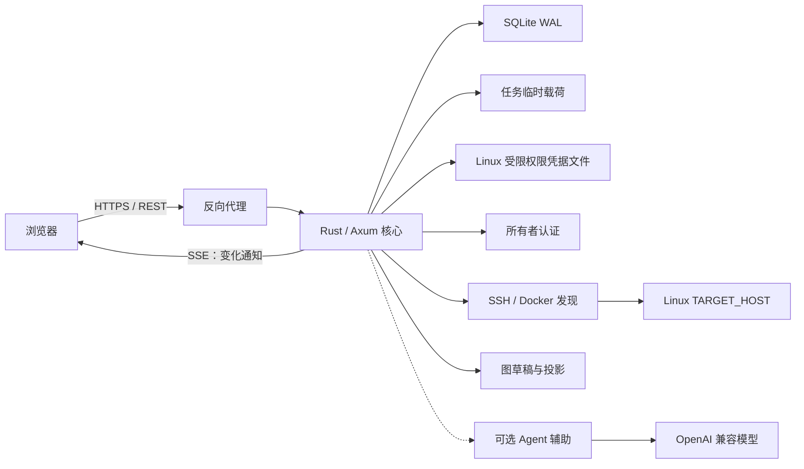

# Rust 后端架构与前后端契约决策

- **状态**：可视化优先的 MVP-1 架构基线已确认；SSH/Linux/凭据/首次指纹流程已锁定
- **版本**：1.5
- **日期**：2026-08-12
- **适用范围**：Linux 服务器远程部署、单一所有者、SSH 只读发现、确定性图草稿、人工投影管理、轻量 Agent 辅助
- **关联文档**：[前后端 API 与数据架构草案](./08-前后端API与数据架构草案.md)

> 本文固定后端语言、存储、通信和前后端边界。首版目标不是追求极限吞吐，而是用最少的基础设施建立可解释、可恢复、可审计的本地业务控制面。

> 文档角色：本文是当前产品 MVP-1 的实现架构。首要产物是由真实事实驱动的可编辑画布；Agent 是可选增强，不建设两层 Agent 责任网络。长期责任模型以 `docs/11` 为参考，但不得反向扩大本架构。

## 1. 决策摘要

后端从第一版开始采用 **Rust 模块化单体**，SSH 发现器作为同进程模块实现；不安排 TypeScript 后端完成后再整体重写 Rust，也不为尚不存在的第二种接入提前建设多语言进程协议。

```text
核心后端：Rust / Axum
前端契约：OpenAPI 生成的 TypeScript 类型
首个适配器：SSH 只读 HOST/Docker 发现
后续适配器：出现第二种真实接入后再决定进程协议与语言
主数据库：SQLite + WAL
原始载荷：任务内临时处理，长期只保存结构化脱敏证据
秘密本体：服务端凭据存储，仅保存引用
模型服务：OpenAI 兼容 URL + Key + Model
通信方式：REST 快照与命令 + SSE 变化通知
部署形态：Linux 服务器模块化单体，经 HTTPS 反向代理访问
```

选择 Rust 的首要原因是长期运行、状态约束、远程任务恢复和可审计性；性能收益是附带结果，而不是前提。

## 2. 前提校正

### 2.1 “Rust 效率高”不足以单独决定技术路线

本项目早期的主要风险是：

- 项目、资源和流程模型仍会演化；
- 外部项目、服务器、Agent 和知识库入口各不相同；
- 运行状态、外部回执和操作历史必须保持一致；
- 前端展示与后端字段容易产生契约漂移；
- 凭据、日志和业务统筹操作需要明确边界。

这些首先是 I/O、状态一致性和工程组织问题，而不是 CPU 吞吐问题。因此，语言选择应围绕长期运行、错误边界和部署成本，而不是只比较基准测试。

### 2.2 “先 TypeScript，再整体重写 Rust”不是低成本过渡

整体重写意味着重复承担后端实现、数据库迁移、状态机调试、适配器测试、前后端联调和部署验证。两套实现并存时，还会出现行为差异和契约漂移。

当前前端是原生 JavaScript，并没有可直接与 TypeScript 后端共享的类型系统。因此，TypeScript 后端在本项目中的“天然同构”收益比表面上更小。

### 2.3 Rust 的真实成本

- 初期开发和编译反馈通常慢于 TypeScript；
- 动态插件和临时集成的编写成本更高；
- 将所有外部连接器都强制写成 Rust 会拖慢接入速度；
- 团队需要遵守清晰的模块和错误处理约定。

对应策略是：当前核心状态机、API、存储和唯一 SSH 发现器都使用 Rust，减少部署与调试面；只有第二种真实接入证明需要独立生命周期或不同语言 SDK 时，才引入进程边界。

## 3. 架构总览



首版是 Linux 服务器上的模块化单体：API、认证、进程内发现任务、图投影、人工编辑和可选 Agent 辅助在同一个 Rust 二进制内运行。模块边界用于约束代码和数据所有权，不提前拆成微服务或通用任务平台。

### 3.1 SSH/Linux 核心边界

- `APP_HOST → SSH → TARGET_HOST` 是 MVP-1 的唯一远程发现链路；SSH 连接检查失败时，本轮发现及其图草稿/辅助建议保持未启动状态。
- 连接检查只验证 SSH 认证与 Linux 身份：两者通过即返回 `connection_ready` 与 `ssh`、`linux` 能力。Docker/Compose 完全属于后续发现任务，不参与服务器连接成功/失败、画布连接统计或服务器操作入口；其缺失或权限不足只作为附加扫描结果记录，HOST 仍保持 `connection_ready`。
- `TARGET_HOST.os` 在 MVP-1 固定为 `linux`。平台字段仍保留，便于后续增加适配器，但首版 API、发现命令和验收样本均按 Linux 定义。
- SSH 是当前 MVP-1 的核心接入能力；长期可以扩展其他 Adapter，但不为尚未选择的入口提前建设通用平台。
- 本地 fixture 只用于前端视觉回归和契约测试，不构成生产接入路径。

MVP-1 的 SSH/Docker 发现器是模块化单体内的受限模块，通过任务超时、输出上限和错误边界隔离。Post-MVP 出现第二种第三方运行时后，再依据崩溃隔离、SDK 语言和部署成本决定是否拆成独立进程。

## 4. 技术栈

| 领域 | 首版选择 | 目的 |
| --- | --- | --- |
| Web 框架 | Axum | 与 Tokio/Tower 生态一致，路由与状态清晰 |
| 异步运行时 | Tokio | 处理 HTTP、SSE、轮询和后台任务 |
| 序列化 | Serde | 统一 API、事件和适配器载荷 |
| 数据库访问 | SQLx | 显式 SQL、迁移和类型检查 |
| 主数据库 | SQLite + WAL | 单一所有者远程部署、事务、备份简单 |
| API 契约 | utoipa / utoipa-axum | 从 Rust 路由和 DTO 生成 OpenAPI |
| 中间件 | Tower / tower-http | 请求追踪、超时、限流和来源检查 |
| 日志 | tracing | 结构化日志和 request_id 关联 |
| 错误模型 | thiserror + 统一 API 错误映射 | 区分领域冲突、外部失败和系统错误 |
| 标识符 | UUIDv4 + 确定性来源哈希 | 本地命令/会话使用不透明 UUID；外部事实和投影节点使用稳定来源身份，排序依赖时间戳、修订或游标 |
| 时间 | UTC ISO 8601 | 后端保存统一时间，前端本地化显示 |

首版不引入 PostgreSQL、Redis、独立消息队列、图数据库或专用向量数据库。只有真实测量触发扩展条件时再增加基础设施。

## 5. 核心模块边界

```text
backend/src/
├── api.rs                         HTTP、错误映射与 OpenAPI
├── auth.rs / events.rs            单一所有者会话、审计与 SSE
├── m1.rs / ssh.rs / discovery.rs  SSH 传输、固定发现、阶段状态与证据
├── projection.rs                  确定性图草稿、读模型、布局与版本
├── discovery_diff.rs              二次扫描差异
├── model_provider.rs              OpenAI 兼容配置、测试与调用
├── onboarding.rs                  Agent 建议、问题、回答和投影补丁
├── data_management.rs             导出、删除、备份记录
├── secrets.rs                     FileSecretStore 与秘密引用
└── storage.rs                     SQLx、迁移、事务和备份校验
```

这些目录表示领域所有权，不代表独立服务。`policy / workflow / run / operation / multi_agent` 是 Post-MVP 候选，不在首版先建空模块、表或通用抽象。跨模块写入通过应用服务和事务完成。

## 6. 前后端职责边界

### 6.1 前端负责

- 当前选择、焦点、悬停和临时提示；
- 画布缩放、平移、拖动过程和动画；
- 把后端读模型转换成节点、连线、时间轨迹和信息面板；
- 发起 HOST 登记、扫描、图草稿编辑/确认和可选 Agent 会话；
- 根据页面上下文决定展示层级，不解释外部事实。

节点拖动过程属于前端即时状态；需要跨会话保留时，只将最终坐标和布局修订写入后端。

### 6.2 Rust 核心负责

- 工作区、所有者、HOST、项目、实体、关系、来源和忽略规则；
- 发现运行、文档证据、确定性图草稿、人工修改和确认版本；
- 可选 Agent 建议、问题会话和补丁；
- OpenAI 兼容模型服务配置和调用状态；
- 外部事实、来源、新鲜度和扫描差异；
- 进程内后台任务、重启中断恢复、最小审计和持久化布局；
- 向前端输出面向页面的读模型，而不是暴露数据库表。

### 6.3 MVP-1 Agent 辅助边界

MVP-1 只实现一个初始化辅助会话。它与前端共用草稿应用服务，但所有输出先进入建议层：

```text
结构化事实 + 脱敏文档摘要 + 当前图草稿
              ↓
        Agent 建议 / 问题 / 补丁
              ↓
       用户采用、拒绝或手动修改
              ↓
          草稿确认与版本发布
```

确定性映射器必须先独立生成图草稿。模型未配置、超时或返回无效结构时，扫描、图显示、人工编辑和确认继续工作。MVP-1 不实现业务统筹 Agent / 项目 Agent 路由、通用 Agent 消息总线、责任契约或外部 `execute`。

### 6.4 适配器负责

- 通过 SSH 连接目标 Linux HOST；
- 执行固定的 Docker/Compose 和文档只读发现；
- 声明 `discover / observe / query` 能力；
- 把外部字段转换成统一事实和回执；
- 返回来源、外部身份、观察时间、新鲜度和脱敏摘要；
- 保留外部系统特有字段，但不让它们侵入核心领域模型。

## 7. 数据存储决策

### 7.1 唯一主库

SQLite 是首版唯一主数据库，开启：

```text
WAL
foreign_keys = ON
busy_timeout
受控连接池
嵌入式迁移
```

SQLite 中同时存在：

1. 可更新的当前状态和配置；
2. 单次扫描证据与不可变的确认投影版本；
3. 追加式审计、变化通知和幂等回执；
4. 发现、连接测试、模型测试和辅助会话各自的阶段状态。

本项目不采用“所有状态都靠事件重放”的完整事件溯源。当前状态使用结构化表直接查询，关键变化同时追加事件，降低首版复杂度。

### 7.2 数据分层

| 数据 | 存储位置 |
| --- | --- |
| 项目、实体、关系、规则、布局 | SQLite |
| 扫描运行、结构化证据、差异和确认版本 | SQLite |
| 审计与 SSE 变化摘要 | SQLite append-only 表 |
| 临时原始扫描输出 | 单次任务临时目录，完成结构化与脱敏后删除 |
| SSH 密码、模型 Key 和 SSH 私钥 | `FileSecretStore` 的 Linux 受限权限文件；SQLite 仅保存引用描述，密码请求只保存 Argon2id 幂等验证值 |
| 删除前备份 | 数据目录中的受限 SQLite/秘密归档；生产环境再复制到站外加密存储 |

### 7.3 事务与事件

业务修改先在所属模块的 SQLite 事务中提交；成功响应通过认证中间件另行追加脱敏审计和 SSE 失效通知。后台发现也先提交运行/证据状态，再追加变化通知。通知写入失败会记录服务端错误，但不回滚已经提交的业务状态。

这是 MVP-1 的明确取舍：SSE 只引用已提交状态、只负责提示前端重读，REST 快照始终是最终状态；短暂漏通知可由重连、页面刷新或下一条事件后的快照重读恢复。当前并非事务性 outbox，如果未来需要保证每次变化必达，再把业务写入与 outbox 事件放入同一事务。

## 8. API 契约

所有业务接口使用 `/api/v1`。数据库表不会一一映射为 CRUD API；前端读取的是页面所需的稳定投影。

### 8.0 远程入口与健康探针

```text
GET  /healthz                 # 反向代理/进程探针，不返回业务数据
POST /api/v1/auth/login       # 单一所有者登录
GET  /api/v1/auth/session     # 会话摘要
POST /api/v1/auth/logout      # 注销会话
GET  /api/v1/events/stream    # 认证后的 SSE
```

`APP_HOST` 运行应用，`TARGET_HOST` 是被 SSH 扫描的 Linux 主机；两者可相同，但必须由用户显式登记。公网入口默认由反向代理终止 HTTPS，Rust 只监听受限内网地址。

### 8.1 快照接口

```text
GET /api/v1/bootstrap
GET /api/v1/views/global/world
GET /api/v1/projects/{project_id}/views/resources
GET /api/v1/hosts
GET /api/v1/hosts/{host_id}
GET /api/v1/discovery-runs/{run_id}
GET /api/v1/discovery-runs/{run_id}/evidence
GET /api/v1/discovery-runs/{run_id}/diff
```

`views/global/resources`、项目运行/流程、操作记录和命令目录属于 Post-MVP 或后续真实接入；原型可以继续使用明确标记的 Fixture。

快照统一包含：

```json
{
  "data": {},
  "meta": {
    "request_id": "REQ",
    "revision": 42,
    "generated_at": "2026-08-10T00:00:00Z",
    "freshness": "fresh"
  }
}
```

响应同时携带 `ETag`。修改请求使用 `If-Match`；修订不匹配返回 `412 PRECONDITION_FAILED`。`409` 留给领域状态冲突。

### 8.2 初始化与 Agent 命令接口

```text
POST  /api/v1/secret-refs
POST  /api/v1/hosts
POST  /api/v1/hosts/{host_id}/connection-tests
POST  /api/v1/hosts/{host_id}/host-key-confirmations
POST  /api/v1/hosts/{host_id}/discovery-runs
GET   /api/v1/projection-drafts/{draft_id}
PATCH /api/v1/projection-drafts/{draft_id}
POST  /api/v1/projection-drafts/{draft_id}/confirm
POST  /api/v1/ignore-rules
PATCH /api/v1/layouts/{layout_id}
POST  /api/v1/onboarding-sessions
GET   /api/v1/onboarding-sessions/{session_id}
POST  /api/v1/onboarding-sessions/{session_id}/messages
GET   /api/v1/discovery-runs/{run_id}/proposal
GET   /api/v1/model-provider
PUT   /api/v1/model-provider
POST  /api/v1/model-provider/test
GET   /api/v1/exports/workspace
GET   /api/v1/hosts/{host_id}/export
GET   /api/v1/projects/{project_id}/export
DELETE /api/v1/workspace
DELETE /api/v1/hosts/{host_id}
DELETE /api/v1/projects/{project_id}
```

发现任务完成后返回 `draft_id`；该草稿由确定性规则产生，不依赖 `/onboarding-sessions`。Agent 会话只追加带证据的建议和补丁。

三个删除接口同时要求 `Idempotency-Key` 与精确的 `X-Confirm-Delete`，并在删除前生成且验证本地备份；导出不包含 SSH 私钥、模型 Key 或会话令牌正文。

`POST /api/v1/action-requests`、流程编辑、持续监督和多 Agent 命令只在后续阶段设计。

发现和配置命令携带 `Idempotency-Key`。接受异步执行的接口返回 `202 Accepted`；MVP-1 不执行外部写操作：

```json
{
  "request_id": "REQ",
  "state": "accepted",
  "submitted_at": "2026-08-10T00:00:00Z"
}
```

`accepted` 只表示核心接收请求。外部动作收到回执并完成重读验证后，才进入 `succeeded`。

### 8.3 统一错误

```json
{
  "error": {
    "code": "CAPABILITY_UNAVAILABLE",
    "message": "当前适配器未声明该动作",
    "details": {
      "target_id": "TARGET",
      "action": "observe"
    },
    "request_id": "REQ"
  }
}
```

前端根据稳定错误码决定界面反馈，`message` 用于人类阅读，`details` 只包含经过脱敏的上下文。

## 9. SSE 实时通信

```text
GET /api/v1/events/stream
```

首版 SSE 主要发送“哪里发生变化”，而不是发送复杂的局部补丁：

```text
id: 1842
event: projection.changed
data: {"scope":"project","project_id":"PROJECT","revision":43}
```

前端收到事件后重新获取受影响快照。单一所有者远程环境中的快照重取成本仍然可控，却能显著减少乱序、漏事件、补丁合并和断线恢复问题。

事件流要求：

- 每条事件都有单调递增游标；
- 支持浏览器 `Last-Event-ID` 续接；
- 定期发送 heartbeat；
- 断线或游标过期时重新获取页面快照；
- SSE 事件只引用已提交数据库状态，并作为提交后的最佳努力失效通知；
- 事件载荷不包含秘密本体和大型日志。

## 10. OpenAPI 与前端类型

契约生成链路只有一个来源：

```text
Rust Route + DTO
        ↓
生成 openapi.json
        ↓
提交并进行差异检查
        ↓
openapi-typescript 生成前端类型
        ↓
薄 API Client
```

持续集成重新生成 OpenAPI，并在结果与仓库版本不一致时报告差异。前端不维护第二套手写响应类型。

当前原生 JavaScript UI 保持现有视觉与交互，只增加数据源边界：

```text
DataSource
├── MockDataSource     仅供原型和固定测试
└── HttpDataSource     连接 Rust API
```

页面依赖的最小接口（按阶段实现）：

```text
# MVP-1 核心（先实现）
getBootstrap()
getGlobalWorld()
getProjectResources(projectId)
getHosts()
getDiscoveryRun(runId)
getEvidence(runId)
getProjectionDraft(draftId)
updateProjectionDraft(draftId, patch)
confirmProjection(draftId)

# MVP-1 增强（核心图通过后实现）
getProposal(runId)
sendOnboardingMessage(sessionId, message)
subscribeEvents()

# Post-MVP 页面
getGlobalResources()
getProjectRun(projectId)
getOperations(filter)
submitObservation(request)
```

TypeScript 可以只用于数据源和生成类型，无需先重写整个界面。

## 11. SSH 发现与适配器协议

首个适配器采用固定的 SSH 只读发现流程：

```text
核心 → SSH 连接目标 Linux HOST
     → 执行固定发现器（Docker/Compose/白名单文档）
     → 接收版本化 JSON 证据包
     → 保存来源、时间、哈希和脱敏状态
```

发现器不接受任意用户拼接的命令字符串。证据包至少包含：

```text
protocol_version
host_identity
discovery_id
compose_projects
containers
images
networks
volumes
document_candidates
health_checks
warnings
started_at / finished_at
```

MVP-1 的具体连接实现固定为：

1. Rust 调用 APP_HOST 上的系统 OpenSSH 客户端，不引入额外 SSH 守护进程。
2. 默认使用服务端 `FileSecretStore` 中的 SSH 账号密码，也支持用户明确提供的 SSH Key；Linux 数据目录与秘密文件使用受限权限，不把密码、私钥或口令写入 SQLite、日志、SSE 或 Agent 上下文。密码请求的幂等记录只保存 Argon2id 验证值，不保存快速摘要。系统不枚举本机或 APP_HOST 的私钥集合，不盲试多把私钥，避免因 `MaxAuthTries` 或错误私钥阻断账号密码登录。
3. 使用严格的 `known_hosts`/主机指纹校验；新指纹先进入 `host_key_unverified`，用户确认后才允许发现。
4. 启用 Docker Provider 时，目标用户需要 Docker 只读权限；适配器不自动 `sudo`，也不在目标机写入脚本或安装常驻组件。该权限不作为 SSH `connection_ready` 的前置条件。
5. 适配器发送版本化固定发现器，回收退出码、超时、输出上限和脱敏摘要；浏览器/模型只传结构化参数。

SSH 连接失败、命令超时、权限不足、Docker 不可用和文档读取失败必须分别记录。以后增加本地 transport、SSH Agent 或其他适配器时，核心只依赖同一份证据协议。

## 12. 互联网单所有者安全边界

“单一所有者”不等于“本地可信浏览器”。首版采用：

- Rust 服务部署在 Linux 服务器，公网入口由 HTTPS 反向代理提供；
- 所有者登录后才能读取工作区、创建 SSH 发现和配置模型服务；
- 修改请求使用会话保护、CSRF 防护、限流和审计；
- SSH 密码、SSH 私钥、模型 Key 和其他秘密只以服务端 `secret_ref` 使用；
- 前端、SSE、日志和 Agent 回复只允许摘要和状态，不返回秘密本体；
- Docker Socket 不暴露到公网；发现器只执行固定的只读操作；
- 反向代理和 SSE 配置必须关闭响应缓冲并支持断线续接。

远程多人协作、复杂 RBAC 和公网开放注册均留到后续边界重新设计。

## 13. 第一条纵向切片

首轮先打通一个**无模型也成立**的真实可视化闭环，再增加 Agent：

```text
用户登录
    ↓
登记 Linux HOST + SSH 凭据引用
    ↓
Rust / Axum 创建 discovery_run
    ↓
SSH 固定发现器读取 Docker/Compose 与项目文档
    ↓
保存证据包与扫描进度
    ↓
确定性规则生成图草稿
    ↓
HttpDataSource 在现有画布显示 HOST、项目和资源关系
    ↓
用户编辑并确认本地投影
    ↓
（增强）Agent 生成建议和问题，二次扫描显示差异
```

实施顺序：

1. 固定全局业务网/项目资源的节点、边、状态、来源和图草稿 DTO；
2. 建立最小 Rust workspace、SQLite 迁移、OpenAPI 与 `MockDataSource / HttpDataSource`；
3. 用 Fixture 通过真实 API 返回同一图契约，确认现有视觉无回归；
4. 实现 HOST、SSH 账号密码/SSH Key 引用、服务端候选指纹获取、用户确认和连接检查；
5. 实现固定只读发现器与版本化 Docker/Compose/文档证据包；
6. 实现事实到图草稿的确定性映射，并接入全局业务网和项目资源图；
7. 实现人工编辑、布局、确认、版本、归档和忽略；
8. 接入 URL/Key/Model、Agent 建议/问题和二次扫描差异；
9. 补齐 SSE、认证、HTTPS、秘密检查、重试、备份与删除，形成可发布 MVP-1；
10. 持续监督、多 Agent、流程执行和外部控制保持 Post-MVP。

## 14. 首轮验收标准

- Rust 服务可在 Linux 服务器启动并通过 HTTPS 访问；
- 所有者登录后才能执行发现和修改配置；
- SSH 发现器只执行固定只读动作；
- 一次 discovery run 可以恢复、失败分类并重新获取最终状态；
- Docker/Compose 和文档证据符合版本化 JSON 契约；
- 发现事实无需模型即可生成带来源的图草稿；
- 全局业务网和项目资源图通过 HttpDataSource 显示真实节点与关系；
- 用户可以手动编辑、确认和保存投影，刷新后保持一致；
- Agent 建议都能关联证据，用户确认前不会发布投影；
- 模型未配置、超时或输出无效时，扫描、图草稿和人工确认仍可用；
- 用户手动归档/忽略后，同一对象不会在下一次扫描中自动恢复；
- 前端切换到 HTTP 数据源后视觉和交互保持一致；
- SSE 断线重连后不会丢失最终扫描和投影状态；
- OpenAI Chat Completions 兼容服务只需 URL、Key、Model；首版非流式，Key 不出现在响应、SSE 和日志；
- MVP-1 不修改目标 HOST，也不执行外部控制动作。

## 15. 仍需从真实项目核验的事实

已确认：MVP-1 默认采用 SSH 账号密码并兼容用户明确提供的 SSH Key；账号密码登录支持标准 SSH Password Authentication 与单密码 Keyboard-Interactive/PAM。账号密码是首次接入和认证失败补救的兜底入口；系统不自动发现、匹配或盲试私钥。多因素/MFA、多轮交互、SSH Agent 和托管公钥安装后置。首次连接由服务端取得主机指纹，界面展示后由用户确认。

1. 目标 HOST 的 Docker/Compose 版本、rootless 模式和可用只读命令；
2. Compose 工作目录、项目文档白名单和大小上限；
3. 公网反向代理、域名、HTTPS 和登录会话方案；
4. 中转是否需要自定义请求头/路径（默认 Chat Completions、非流式）；
5. 首个项目文档中哪些内容必须人工确认；
6. 后续是否增加多 HOST transport。

这些事实会决定首个适配器和部署细节，但不改变 MVP-1 的核心边界：SSH 只读事实、确定性上图、人工管理、可选 Agent 辅助和投影发布。

## 16. 最终结论

> 当前产品 MVP-1 采用 Linux APP_HOST 上的 Rust/Axum 模块化单体；SQLite WAL 作为唯一主库；REST 提供图、任务和草稿快照/命令，SSE 提供变化通知；SSH 账号密码（默认）或 SSH Key 只读发现 Linux TARGET_HOST 上的 Docker/Compose 和项目文档；确定性规则先生成可编辑图草稿，用户能够独立确认投影；OpenAI 兼容的 URL、Key、Model 只提供辅助建议。完整 Agent 责任网络、流程运行和外部控制均为 Post-MVP。

### 16.1 Windows 开发机与 Linux 发布机的双平台验收门槛（2026-08-13）

- Windows 是当前开发和浏览器验收环境；Windows 通过只说明本地二进制、Windows OpenSSH 和前端链路可用，不等同于 Linux 发布验收通过。
- Linux APP_HOST 是实际部署平台。发布前必须在 Linux 工具链中执行 `cargo test --workspace`、`cargo build --locked --release -p network-atlas`，并用 Linux `ssh` / `ssh-keyscan` 完成至少一次账号密码认证回归。
- 账号密码路径在两种平台都复用正在运行的 `network-atlas` 二进制作为 `SSH_ASKPASS`。OpenSSH 只接收 `SSH_ASKPASS` 的无换行输出；Windows 不再依赖临时 `.cmd`，Linux 也不依赖 shell 脚本。凭据仍只通过进程环境短暂传给子进程，不写入 SQLite、响应、SSE 或日志。
- `deploy/Dockerfile` 是 Linux 发布构建的最终依据，运行镜像必须包含 `openssh-client`，并通过 `/healthz` 后再开放公网入口。Linux 容器内的 `current_exe` 必须可执行，这是密码登录回归的前置条件。
- 交付验收记录必须分别标出 `windows-dev` 与 `linux-release`，并记录命令、输入类型（不记录秘密正文）、字面输出和退出状态；只有两套结果都通过，才把“密码登录链路已通过”作为发布结论。

## 17. 真实服务器与显示名称补充决策（2026-08-12）

- 已登记 HOST 即属于真实数据，即使还没有扫描投影；`bootstrap` 和全局图必须返回这些 HOST，且项目数可以为 0。
- HTTP 页面读取或扫描失败时不得回退为 Fixture 项目；Fixture 仅用于显式原型模式。
- Compose 项目原名、服务原名和容器原名是扫描事实，只读保存；服务器的 `address / port / ssh_user` 是用户登记的连接配置，不是远端扫描事实。
- `PATCH /api/v1/hosts/{host_id}` 可修改服务器别名、地址、SSH 端口、SSH 用户以及新的 `credential_ref`。只改别名时保留连接状态；地址、端口、用户或 Key 变化时必须清除旧指纹确认与最近连接结果，状态回到 `host_registered`，重新取得并确认指纹。
- `credential_ref` 只作为 SecretRef 创建响应和 HOST 写请求之间的绑定句柄；HOST 读响应与连接测试响应不回显它。连接测试响应返回 `port`、`ssh_user`、`credential_kind` 和实际 `auth_transport`，以便验收前端提交与 SSH 分支，同时不暴露 secret 或本地 Secret 路径。
- 更换 SSH 密码或 SSH Key 必须先创建新的 SecretRef；前端不回显旧凭据。连接配置修改不删除旧 SecretRef，以免破坏仍引用它的其他 HOST；后续由显式秘密清理流程处理孤立引用。
- `assign_project` 只改变项目归属关系，界面称为“绑定项目 / 项目归属”，不得把容器名直接改写成项目名。
- 每个已登记 HOST 必须显示最近连接状态和真实错误码。Docker/Compose 发现失败表示 SSH/Linux 已连接但当前不具备 Docker 项目发现条件；界面保留服务器并显示修复方向，不能把它显示为 SSH 失败。`connection_ready` 可以创建发现任务；达到 `evidence_ready`（旧兼容）、`discovery_complete` 或 `discovery_partial` 后展示已经取得的 Provider、部署和资源结果，失败 Provider 单独显示原因；`discovery_unavailable` 不产生草稿或 Agent 会话。

## 18. 业务统筹 Agent 画布投影补充决策（2026-08-12）

- `PUT /api/v1/model-provider` 保存的是工作区级业务统筹能力配置；配置存在时，`GET /api/v1/views/global/world` 必须额外返回一个稳定的 `workspace` 节点，节点 ID 固定为 `business-coordinator-agent`，显示名称固定为“业务统筹 Agent”。
- 前端不得再用静态 Fixture 节点冒充该 Agent。真实模式只渲染全局图接口返回的节点，因此保存并测试模型后必须刷新全局图。
- 节点只披露 `base_url`、模型名、Key 已保存状态、配置版本、更新时间以及最近测试摘要；`credential_ref`、Key 正文和 Secret 路径不得进入图响应。
- 最近测试为 `reachable` 时节点为 `confirmed / 可用`；最近测试为 `failed` 时为 `unavailable / 测试失败`；尚无测试记录时为 `stale / 待测试`。
- 模型配置只是 Agent 能力登记，不是 Docker/Compose 扫描证据，也不证明 Agent 与任一 HOST 存在业务关系。MVP-1 首版不虚构连线；即使节点出现，项目数仍可为 0，界面仍须显示“尚未取得首批 Provider 扫描证据”。

## 19. 业务层与资源层修正决策（2026-08-12）

- 业务统筹 Agent 的直接统筹对象是**业务任务**，不是 Linux HOST，也不是把项目本身当作待执行对象。项目只作为任务的作用域/归属；关系主链固定为 `Agent → Task → Project`，服务器可由任务通过资源依赖引用。禁止绘制 `Agent → HOST`，也不以 `Agent → Project` 冒充尚不存在的任务委托。
- 全局业务网只显示业务统筹 Agent、业务任务和任务关联的项目作用域；未建立业务任务时允许只显示 Agent 与“尚无业务任务”的空状态，不把已登记服务器、连接检查、扫描作业或项目本身塞入任务层充数。
- Linux HOST、地址、端口、SSH 用户、凭据引用、连接状态、错误与扫描入口属于 `global/hosts` 服务器资产层。`global/resource` 只承担共享资源集合与影响反查。
- MVP-1 的服务器操作限定为：立即重连、编辑连接信息、更换 SSH 密码或 SSH Key、查看失败原因、连接就绪后重新扫描以及既有的本地删除；不扩展终端、服务重启或容器 CRUD。
- 错误引导按事实分类：`SSH_AUTH_FAILED` 优先更换密码/Key 或核对用户；`SSH_UNREACHABLE` 或 `SSH_TIMEOUT` 优先检查地址/端口后重连；`host_key_changed` 优先核对新指纹。错误摘要仍必须脱敏。

### 19.1 当前实现缺口（不得伪装完成）

- 当前后端的 `TaskSummary / TaskState` 只是异步请求摘要契约，数据库尚无业务 `Task` 实体、任务列表 API 或 `GraphNodeKind::Task`；扫描任务也不是业务统筹任务。
- 因此本轮只修正分层、过滤和空状态，不生成假任务节点。真正绘制 `Agent → Task → Project` 前，必须先补最小业务任务模型与真实来源。
- MVP-1 可视化与真实 HOST 验收不因此扩展为任务管理系统；业务任务模型作为紧随 MVP-1 的独立增量决策，不能阻塞服务器扫描、项目识别和资源上图。

## 20. 下一阶段运维对象与服务器页面决策（2026-08-14）

本节是当前文档关于项目发现、部署归属、ProjectTarget 和服务器页面的最新补充；实现以前文把候选直接当成项目的表述，以本节和 docs/13 为准。

本轮只在旧 `Project` / `ProjectionDraft` 契约上实现 Provider 状态与服务器读模型；TechnicalProject 和 ProjectTarget 仍是后续模型迁移，不新建未实现的存储结构。

### 20.1 对象边界

    Business
    └── TechnicalProject
        └── ProjectTarget
            ├── Deployment
            └── HOST

- Provider 只产生 Evidence 和 DeploymentCandidate；
- 确定性投影器把候选归并为 Deployment 草稿；
- 用户确认后，ProjectTarget 把 TechnicalProject 绑定到具体 Deployment/HOST；
- Deployment 不保存单值 project_id，避免共享或重新归属时覆盖外部身份；
- CodeWorkspace 不进入运维核心模型，代码修改由专用开发 Agent 管理；
- ProjectTarget 是本地关系、适配器和能力范围，不等于权限授予或远程写入。

### 20.2 发现部分成功

SSH/Linux 基线失败时结束该轮；Docker/Compose、systemd、PM2、端口/进程和用户确认目录 Provider 独立报告 ready、unavailable、permission_denied、timed_out 或 failed。Docker 缺失只降低 coverage，HOST 仍可保持 connection_ready。

当前只执行 docker/compose/systemd；根目录和 documents 仍未实现。所有已执行 Provider 都 ready 为 `discovery_complete`，部分 ready 为 `discovery_partial`，无 ready 为 `discovery_unavailable`；ready 且 `observed_count = 0` 是成功空结果。旧 `evidence_ready` 与 complete / partial 都可产生草稿，unavailable 不产生草稿。

### 20.3 服务器资产页

新增 global/hosts 读模型和页面，展示 HOST 连接、Provider 覆盖、DeploymentCandidate/Deployment、最近观测、证据新鲜度和关联项目。global/world 不把 HOST 作为业务首屏；global/resource 只承担共享资源集合与影响反查；HOST 登记、重连、只读发现和证据查看都放在 global/hosts。

### 20.4 Project Agent 权限

Project Agent 的上下文覆盖其 TechnicalProject 的全部 ProjectTarget、Deployment 观察、相关 HOST 能力和共享资源引用；读取通过 typed adapter 按需进行。有效权限为全局硬限制、BusinessPolicy、ProjectAgentPolicy、ProjectTarget.capabilities 和本次审批的交集。任意 HOST Shell、远程写入、重启和部署不因项目选中而自动获得。
